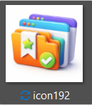
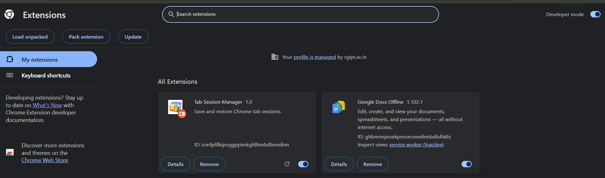
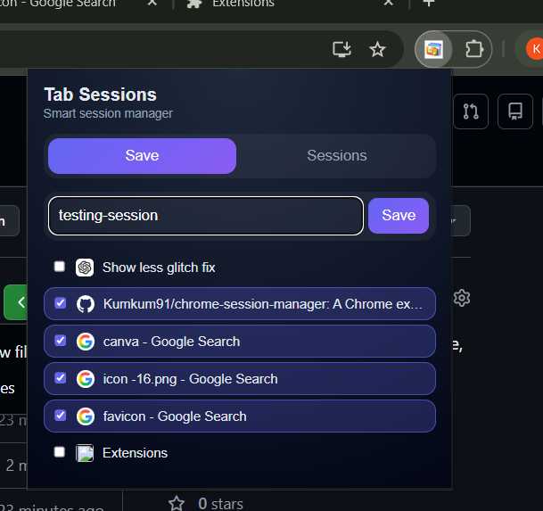
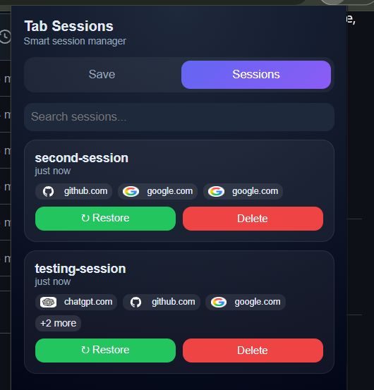

# Tab Session Manager (Chrome Extension)

An advanced Chrome Extension to efficiently save, manage, and restore browser tab sessions with a clean, modern, and premium dark UI.

---

## Features

-  Save selected tabs into custom named sessions  
-  Search and filter saved sessions instantly  
-  Restore sessions anytime  
-  Delete sessions easily  
-  Clean, minimal, dark premium UI  
-  Tab icons using `tab.favIconUrl` (no external favicon APIs)  
-  Smooth and responsive performance  
-  Proper error handling (no 404 / favicon issues)

---

##  Key Highlights

-  No external favicon APIs used (avoids `ERR_NAME_NOT_RESOLVED` issues)  
-  Uses only `tab.favIconUrl` or stored icons  
-  Handles invalid/restricted URLs (`chrome://`, local IPs, etc.) safely  
-  Designed with a modern dark/glass UI approach  
-  Optimized rendering for better performance  

---

## 🛠️ Tech Stack

- **Manifest V3**
- **JavaScript (Vanilla)**
- **HTML5 & CSS3**
- **Chrome Extension APIs**
  - `chrome.tabs`
  - `chrome.storage`

---

## 📂 Project Structure


```
tab-session-manager/
│
├── manifest.json
├── popup.html
├── popup.js
├── popup.css
├── icons/
│ ├── icon16.png
│ ├── icon32.png
│ └── icon192.png
```
---

## ⚙️ Installation (Manual)

1. Download or clone this repository  
2. Open Chrome and go to:


chrome://extensions/


3. Enable **Developer Mode** (top right)  
4. Click **Load Unpacked**  
5. Select the project folder  

##Example


---

## 📸 Screenshots

### Save Tabs View


### Sessions View



---

##  Future Improvements

-  Auto session backup  
-  Cloud sync (Google account integration)  
-  Export / Import sessions  
-  Drag & reorder sessions  
-  Restore session in new window  
-  Enhanced duplicate tab detection  

---

##  Constraints & Design Decisions

-  Avoided Google favicon APIs (to prevent network errors)  
-  Only `tab.favIconUrl` used for icons  
-  Handles restricted/internal URLs safely  
-  Focus on performance + clean UI (no heavy frameworks)  

---

## 👨‍💻 Author

**Kumkum**

---

## ⭐ Why this Project?

This project demonstrates:
- Strong understanding of Chrome Extension APIs  
- Clean UI/UX design principles  
- Efficient data handling using browser storage  
- Real-world productivity problem solving  

---

## 🔗 GitHub Repository

👉 https://github.com/kumkum91/chrome-session-manager
